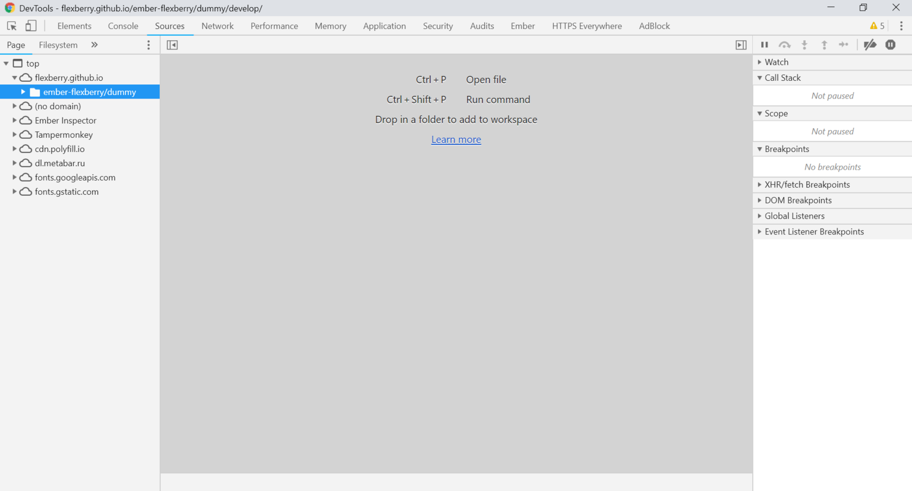
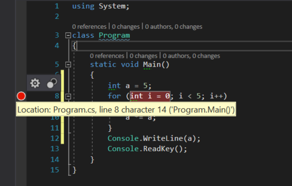

## Отладка

### Отладка JavaScript и Ember.js с использованием Chrome Web Tools
При разработке массивных SPA наиболее удобно отлаживать код JavaScript с помощью стандартной консоли браузера Google Chrome (Chrome Web Tools).


Приложения на Ember.js также удобно отлаживать с помощью аддона [Ember Inspector](https://chrome.google.com/webstore/detail/ember-inspector/bmdblncegkenkacieihfhpjfppoconhi)

#### Наиболее частоиспользуемые вкладки инструмента:
* `Elements` — HTML-код отображаемой страницы. 
* `Console` — JavaScript-консоль. Контекстом выполнения команд является текущий контекст всего веб-приложения. То есть, если код остановлен (например, точкой останова), то текущим контекстом будет являться место, где остановилось выполнение программы. Это очень удобно.
* `Sources` — проводник файлов веб страницы. Непосредственно в этой вкладке можно отлаживать JavaScript-код.
* `Network` — отображение работы с сетью. С помощью этой вкладки можно удобно отслеживать обмен данными между клиентским приложением и бекендом.
* `Ember` — если вы используете аддон [Ember Inspector](https://chrome.google.com/webstore/detail/ember-inspector/bmdblncegkenkacieihfhpjfppoconhi), то в этой вкладке можно более детально, но в то же время просто посмотреть "под капот" фреймворка: просмотреть все Routes приложения, информацию о рендере, цепочки Promises и так далее.

##### Отладка кода
Для отладки JavaScript проще всего пользоваться **точками останова** (_breakpoints_). Точку останова можно поставить на строчку кода JavaScript, либо, при необходимости, можно остановить выполнение JS при определённом изменении DOM. Это делается следующим образом во вкладке `Elements`:


Открыть JS-файл через DevTools можно нажав `Ctrl+P` и введя название искомого файла, либо можно вручную найти его во вкладке `Sources`. После этого можно установить точку останова нажатием на номер строки. При нажатии на ПКМ точку останова можно настроить, например, задать условие остановки.


Используя правый сайдбар можно посмотреть стек вызовов (`Call Stack`) [3], настроить выражения для отслеживания (`Watch`) [2]. В разделе `Scope` показаны контексты, в разделе `Breakpoints` находится список точек останова, сработавшая выделена цветоп. В верхней части сайдбара находятся кнопки пошагового исполнения [1], кнопка игнорирования точек останова и кнопка, включающая остановку исполнения при возникновении исключения [6].


Значения переменных можно получить, используя консоль (вкладка `Console`), используя раздел `Watch` правого сайдбара или просто наводя мышь на переменную.

##### Просмотр запросов

Просмотреть запросы к бекенду можно на вкладке `Network`. Во вкладке отображается таймлайн исполнения запросов, и их список [1]. После выбора запроса в списке можно получить детальную информацию о запросе [2], а так же полученный ответ [3] и полученый JSON [4].


### Отладка C# с использованием Visual Studio

Отладка C# кода проводится аналогично отладке JS-кода, о ней написано выше.
Стандартные инструменты среды Visual Studio (на момент написания использована VS2017) позволяют комфортно отлаживать программу. Попасть в интерфейс отладки проще всего с помощью установки точки останова.



В меню можно установить настройки срабатывания точки останова. Это может быть как какое-то логическое условие, так и количество попаданий в строку. Кроме этого, можно настроить вывод какой-то информации в *Output window*, а не просто остановку.

Рассмотрим окно Visual Studio в режиме отладки.


1. Вкладки Locals, Watch. С помощью этих вкладок можно смотреть значения переменных в текущем контексте (Locals) или заданные вручную (Watch). Кроме этого, посмотреть текущее значение переменной можно просто наводя на неё указатель мыши.
2. Вкладка Call Stack показывает стек вызовов, во вкладке Exception Settings можно настроить поведение при различных исключениях.
3. В разделе Diagnostic Tools находится информация об использовании приложением памяти и ресурсов процессора, данные отображены на таймлайне. Кроме этого, на таймлайн наносятся различные события (например, при работе с ASP.NET на таймлайн наносятся запросы к серверу) и исключения. Нажатие на событие на таймлайне позволяет перейти в режим Historical Debugging.

## Отладка Mono-приложений

1.Выполнить команду

```
docker pull akosinsky/monodevelop-ember:latest
```

2.Установить [XServer](http://www.netsarang.com/download/down_xmg.html) под windows.

3.Запустить XServer.

4.Выполнить команду

```
docker run -dti --network host -e "PATH=/usr/local/sbin:/usr/local/bin:/usr/sbin:/usr/bin:/sbin:/bin:/root/projects/scripts" -e "DISPLAY=<IP-custom>" -e "http_proxy=http://<IP-custom>" -v с:/catalog:/childrencatalog  developer/monodevelop-ember:latest /usr/bin/mate-terminal --disable-factory
```

5.В открывшимся окне терминал выполнить команду:

```
monodevelop&
```

6.Открыть нужный проект и в свойствах указать:


7.В Visual Studio указать:

[MdbConverter.exe](https://github.com/Flexberry/mono/tree/MdbConverter). с:/catalog:/childrencatalog

Чтобы собрать `MdbConverter` необходимо:
1. Выполнить git clone https://github.com/Flexberry/mono
2. git checkout MdbConverter
3. Открыть в Visual Studio проект 
mono\mcs\tools\pdb2mdb\MdbConverter.csproj
4. Выполнить Build.


8.В итоге можно выполнять отладку:


## Программное обеспечение

* [Mono](http://www.mono-project.com/download/#download-win)
* [Xamarin Studio](https://www.xamarin.com/studio)

## Перейти

* [Командная разработка](gbt_team-management.html)
* [Главная страница курса](gbt_landing-page.html)